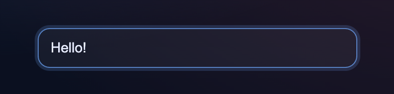
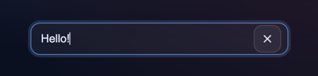
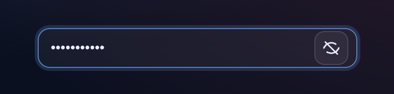
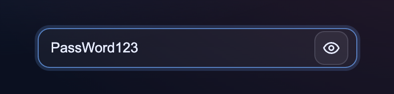
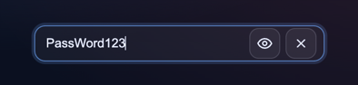
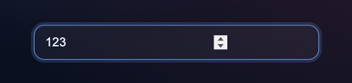
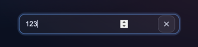
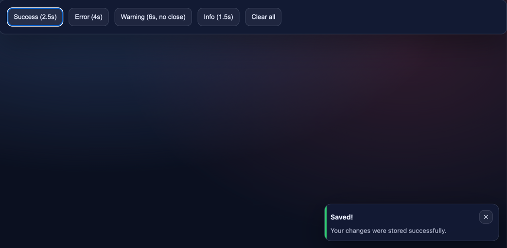
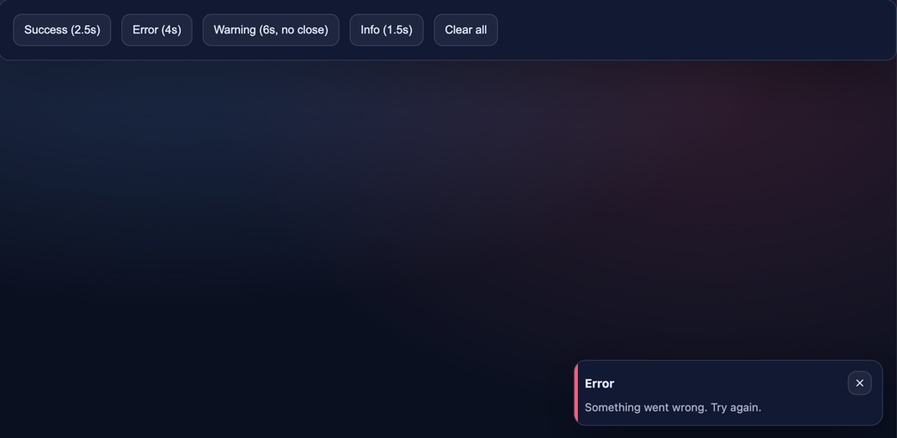
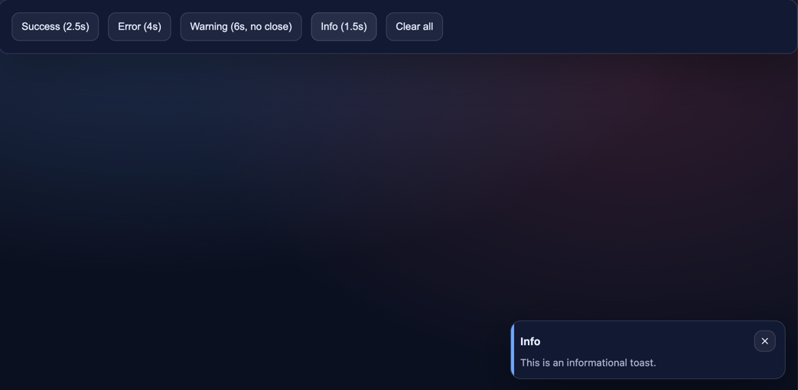

# React Component Library (Storybook)

A small React UI component library built with **TypeScript**, **Vite**, and **Storybook**.  
Includes three reusable components: **Input**, **Toast**, and **SidebarMenu**, each documented with multiple states in Storybook and screenshots in this repository.

---

## ✨ What’s inside

- **Input** — supports `text | password | number`, password visibility toggle, and optional clear button
- **Toast** — bottom-right notifications with auto-dismiss, type variants, and optional close button
- **SidebarMenu** — right-side sliding menu with 1-level and 2-level nested items, overlay click to close

---

## 🧰 Tech

- React + TypeScript
- Vite
- Storybook (with Controls)

---

## 🚀 Setup & Run

### Prerequisites
- Node.js **18+**
- npm (or yarn/pnpm — but commands below use npm)

### Install
```bash
npm install
```

### Run Vite dev server
```bash
npm run dev
```

### Run Storybook
```bash
npm run storybook
```

---

## 🗂 Project structure
```txt
src/
├─ components/
│  ├─ Input/
│  │  ├─ index.ts
│  │  ├─ Input.css
│  │  ├─ Input.stories.tsx
│  │  └─ Input.tsx
│  ├─ SidebarMenu/
│  │  ├─ index.ts
│  │  ├─ SidebarMenu.css
│  │  ├─ SidebarMenu.stories.tsx
│  │  └─ SidebarMenu.tsx
│  └─ Toast/
│     ├─ index.ts
│     ├─ Toast.css
│     ├─ Toast.stories.tsx
│     ├─ toastContext.ts
│     ├─ ToastItem.tsx
│     ├─ ToastProvider.tsx
│     ├─ ToastViewport.tsx
│     └─ useToast.ts
├─ styles/
│  └─ global.css
├─ App.tsx
├─ index.ts
└─ main.tsx
```

## 🧩 Components

### 1) Input

A compact input component with:
- `text` | `password` | `number` types
- password visibility toggle (eye icon) when `type="password"`
- clear button when `clearable={true}`

**Props**

| Prop | Type | Default | Description |
|------|------|---------|-------------|
| `type` | `'text' \| 'password' \| 'number'` | `'text'` | Input type |
| `placeholder` | `string` | `''` | Placeholder text |
| `clearable` | `boolean` | `false` | Show “clear” (X) button |
| `onChange` | `(value: string) => void` | - | Called on value change |

**Usage**

```tsx
import { Input } from "./src";

export function Example() {
  return (
    <div style={{ width: 360 }}>
      <Input type="text" placeholder="Type something..." clearable onChange={(v) => console.log(v)} />
    </div>
  );
}
```

**📸 Screenshots**

<table> <tr> <td align="center"> <br/> <b>Text (default)</b> </td> <td align="center"> <br/> <b>Text (clearable)</b> </td> </tr> <tr> <td align="center"> <br/> <b>Password (hidden)</b> </td> <td align="center"> <br/> <b>Password (visible)</b> </td> </tr> <tr> <td align="center"> <br/> <b>Password (clearable)</b> </td> <td align="center"> <br/> <b>Number</b> </td> </tr> <tr> <td align="center" colspan="2"> <br/> <b>Number (clearable)</b> </td> </tr> </table>

---

### 2) Toast

A toast notification system:
- rendered in the **bottom-right corner**
- auto-dismiss after `durationMs`
- supports types: `success | error | warning | info`
- optional close button (`closable`)
- enter/exit transitions (fade/slide)

**API (Provider + Hook)**
Toasts are pushed via context hook (`useToast`) inside `ToastProvider`.

**Toast push payload**

| Field        | Type                                          |  Default | Description              |
| ------------ | --------------------------------------------- | -------: | ------------------------ |
| `type`       | `"success" \| "error" \| "warning" \| "info"` | required | Visual variant           |
| `title`      | `string`                                      | required | Main title               |
| `message`    | `string`                                      |      `-` | Optional body text       |
| `durationMs` | `number`                                      | required | Auto-dismiss timeout     |
| `closable`   | `boolean`                                     |  `false` | Show manual close button |

**Usage**

```tsx
import { ToastProvider, ToastViewport, useToast } from "./src";

function DemoButtons() {
  const { push } = useToast();

  return (
    <button
      onClick={() =>
        push({
          type: "success",
          title: "Saved!",
          message: "Your changes were stored successfully.",
          durationMs: 2500,
          closable: true,
        })
      }
    >
      Show toast
    </button>
  );
}

export function App() {
  return (
    <ToastProvider>
      <DemoButtons />
      <ToastViewport />
    </ToastProvider>
  );
}
```

**📸 Screenshots**

<table> <tr> <td align="center"> <br/> <b>Success</b> </td> <td align="center"> <br/> <b>Error</b> </td> </tr> <tr> <td align="center"> <br/> <b>Warning</b> </td> <td align="center"> <br/> <b>Info</b> </td> </tr> </table>

---


### 3) SidebarMenu

A right-side sliding menu:
- opens with a hamburger button (top-right)
- closes via overlay click or close (X) button
- supports nested navigation items:
    - **1-level** (flat list)
    - **2-level** (expandable items with children)

**Props**

| Prop      | Type            |  Default | Description                             |
| --------- | --------------- | -------: | --------------------------------------- |
| `open`    | `boolean`       | required | Whether sidebar is open                 |
| `title`   | `string`        | `"Menu"` | Title at the top                        |
| `items`   | `SidebarItem[]` | required | Menu items (supports children)          |
| `width`   | `number`        |    `380` | Sidebar width in px                     |
| `onOpen`  | `() => void`    | required | Called when hamburger button is clicked |
| `onClose` | `() => void`    | required | Called on overlay click / close button  |


**Usage**

```tsx
import { SidebarMenu, type SidebarItem } from "./src";
import React from "react";

const items: SidebarItem[] = [
  { id: "dashboard", label: "Dashboard", onClick: () => console.log("Dashboard") },
  {
    id: "projects",
    label: "Projects",
    children: [
      { id: "a", label: "Project A", onClick: () => console.log("A") },
      { id: "b", label: "Project B", onClick: () => console.log("B") },
    ],
  },
];

export function Example() {
  const [open, setOpen] = React.useState(false);

  return (
    <SidebarMenu
      open={open}
      title="Menu"
      items={items}
      onOpen={() => setOpen(true)}
      onClose={() => setOpen(false)}
    />
  );
}
```

**📸 Screenshots**

<table> <tr> <td align="center"> <br/> <b>Closed</b> </td> <td align="center"> <br/> <b>Open (1-level)</b> </td> </tr> <tr> <td align="center" colspan="2"> <br/> <b>Open (2-level)</b> </td> </tr> </table>

---

## 🧹 Lint & Format (optional)

These commands help keep code consistent:

- `npm run lint` — runs ESLint across the project
- `npm run format` — formats files with Prettier (if configured in scripts)

If you don’t run them, the project still works — they’re mainly for clean CI/PR-ready code.